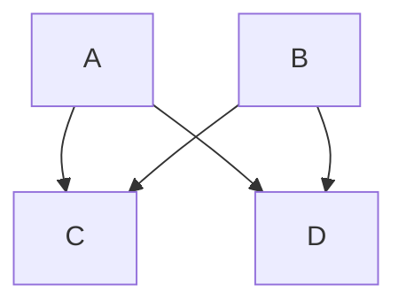

# Help page

## Introduction

Daedalus is a collaborative [documentation-as-code](https://www.writethedocs.org/guide/docs-as-code/) platform which unifies tooling require to create new narrative design documents. It leverages [Markdown](https://www.markdownguide.org/), [Mermaid Charts](https://www.mermaidchart.com/) and [PlantUML](https://plantuml.com/) to empowered users to create a narrative document with embedded diagrams. The document can be synchronised to their code repository to store the document as code.

Daedalus has two main entities **Projects** and **Documents**.

### Documentation as code

Documentation as code is a philosophy used to create higher quality documentation by treating documents the same was Software Developers treat software. Defining the document in code, using the same tool chain as software development and storing it alongside code.  

In [Docs Like Code](https://www.docslikecode.com/about/), Anne Gentle describes documentation as code as:  

* Collaborating with contributors efficiently by keeping docs close to code or in the same system as code, with a source file concept and an output for deliverables.
* Building documentation as repeatably and consistently as possible across multiple platforms. While typically done with open source tools, the main driver is not open source but open, repeatable, consistent collaboration.
* Applying software development tools and techniques to documentation about software, application programming interfaces (APIs), or other technical topics.
* Learning enough about web development to be dangerous and create beautiful, modern docs.
* Valuing technical accuracy and consistency.
* Trusting team members to value documentation, respect end-users needs, and advocate for the best deliverables for consumers of the documentation.
* Automating and integrating documentation builds so you and your teams can focus on content.  

## Projects  

Projects are organisational unit that groups together documents that contribute to a similar theme or goal.  

An example of a Project is a software development project, where a new product is designed and built. The project may contain multiple documents, such as research papers, business cases, system designs, user workflow diagrams or user documentation.
## Documents

Documents are narratives or diagrams that provide information or evidence. They are used to tell a specific story within a project. 

An example of a document is a system design for a software project. This will contain narrative prose, describing users stories. problem domains and implementation detail. As part of this document, the author will use a mixture of prose and diagrams. 

## Collaboration

Daedalus support real-time collaboration on documents in the Editor. Two users, in different browsers can edit the same document, with changes from each user being propagated to the other users.

Users can see where other users are in the document by the coloured cursors.

Hovering over the cursor illustration who that person is.

Multiple user can editor the document at once and additional collaborators can be added using the Share button in the menu.

Users can collaborate on diagrams-as-code. This simulates "users around a whiteboard" where users can add statements to update the diagram in real time and see the result of the changes made.

# Daedalus User interface

Daedalus has a number of User interfaces to support the creation of Projects and Documents.
## Home

The home page is the main landing paged for users after they log it. It contains a development news feed, which developers use to inform users of changes to the platform.
## My Projects

The *My Projects* page contains a list of projects owned by the user.

Users can perform the following actions on this page:

- Create a new project
- Update a projects description
- Open the project
- Delete the project

Clicking on a project take the user to a page listing the the collection of documents under that project.

User can perform the following actions on this page:

- Create a Document
- Update a document
- Open the document for editing
- Delete the document

Clicking on a document, takes the user to the Editor.

## My Documents

The *My Documents* page shows all the projects that the user owners, regardless of which project they are in. This allows users to find and compare documents.
## Shared Documents

The *Shared Documents* page lists all the document that have been shared with the user.
## Editor

The editor is the main interactive component of Daedalus, it contains a text Editor in the left panel and a Preview panel on the right.

User update the code in the Editor panel and the Preview shows the result of the code when it is rendered.

### Markup languages

Daedalus uses markup languages to add formatting and specify diagrams using simple text. This is rendered within Daedalus in the Preview panel.

#### Markdown

Daedalus uses a markup language called [Markdown](https://www.markdownguide.org/). Markdown allows users to specify formatting using marks in the document.

```markdown

# Hello world

This is a markdown document

## Header 2

*Italics*
**Bold**

Bullet list
- First
- Second
- Third

```

More information on Markdown and a cheatsheet can be found here: <https://www.markdownguide.org/cheat-sheet/>

#### Mermaid

[Mermaid Charts](https://www.mermaidchart.com/) is a language that uses text based descriptions of diagrams to render charts and diagrams.

**Example**

```
flowchart TB
A --> C
A --> D
B --> C
B --> D
```

Renders:



This can be used by multiple users, editing the definition simultaneously to mimic multiple users at a whiteboard.  

More information on Mermaid can be found here: <http://mermaid.js.org/intro/>

#### PlantUML

[PlantUML](https://plantuml.com/) is a used to draw UML diagrams, using a simple and human readable text description. It support a wide number of differ UML entities and flows. PlantUML can be expanded to support different components, such as AWS icons for system diagram.

**Example**
```
Bob->Alice : Hello!
```

Renders:

```plantuml
Bob->Alice : Hello!
```

More information about PlantUML can be found here: <https://plantuml.com/starting>

### Features

Daedalus has features to support the Documentation as Code philosophy as well as enabling multiple remote users to collaborate on a single document.

## Collaboration

Users of the platform can collaborate on documents in real time, using the Editor and can share documents of other users of the platform through the Sharing functionality.

The goal of Daedalus is to reduce the friction of creating documents in a distributed team.

#### Sync with Github

Daedalus can synchronise documents in the platform into Github repositories. It does this using a [Github App](https://docs.github.com/en/apps/overview).

User give the Github App authorisation to their repository by going to the [Profile](/profile) page and clicking **Connect to Github** application.

#### Connecting your Github account

- Go to [Profile](/profile)
- Click **Connect your Github**
- On Github, sign in and select which git repositories you would like Daedalus to have permission to
- Click **Install & Authorize**

#### Synchronise document

- Go to the document you would like to sync
- In the Editor, open the **Menu**
- Click **Sync to Github**
- Select the git repository you would like to sync your document with
- Enter a commit message
- Click **Sync**

By default, Daedalus saves documents in the `docs/<document_name>.md` path in your repository.

#### Download

Users can download the document from Daedalus.

- Go to the document you would like to download
- In the Editor, open the **Menu**
- Click **Download**

#### Sharing

By default, the document owner is the only user that can access the document. To enable collaboration between users, a users can share the document. This permits the other user to collaborate on the document in real time.

- Go to the document you would like to sync
- In the Editor, open the **Menu**
- Click **Share**
- The interface will show the users the document is shared with
- In the **Add user** field, select the user you wish to share with
- Click **Share**

#### Save

User have two options for saving the document.

#### Auto save

The document will autosave after changes are made. When the user stops typing, Daedalus will automatically save the document in the background.

#### Manual save

The user can manually save the document by:

- Go to the document you would like to sync
- In the Editor, open the **Menu**
- Click **Save**

## Profile

The profile page provides information on the logged in user. Including their name, photo and creation date.

On the project page, users can authorise Daedalus to their GitHub account. This is done by clicking the **Connect to Github** button. User will be redirected to Github to authorise Daedalus within their account. Once authorised, Daedalus can synchronise documents to Github.